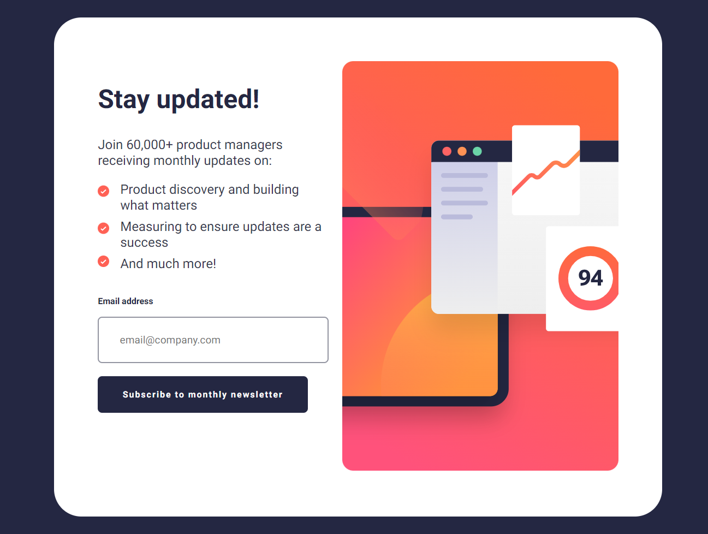

# Frontend Mentor - Newsletter sign-up form with success message solution

This is a solution to the [Newsletter sign-up form with success message challenge on Frontend Mentor](https://www.frontendmentor.io/challenges/newsletter-signup-form-with-success-message-3FC1AZbNrv). Frontend Mentor challenges help you improve your coding skills by building realistic projects. 

## Table of contents

- [Overview](#overview)
  - [The challenge](#the-challenge)
  - [Screenshot](#screenshot)
  - [Links](#links)
- [My process](#my-process)
  - [Built with](#built-with)
  - [What I learned](#what-i-learned)
- [Author](#author)


## Overview

### The challenge

Users should be able to:

- Add their email and submit the form
- See a success message with their email after successfully submitting the form
- See form validation messages if:
  - The field is left empty
  - The email address is not formatted correctly
- View the optimal layout for the interface depending on their device's screen size
- See hover and focus states for all interactive elements on the page

### Screenshot
- Desktop 



- Mobile


### Links

- Solution URL: [Github](https://github.com/Dhanveeryadav/newsletter-signup)
- Live Site URL: [Live-site](https://chic-sable-66f919.netlify.app)

## My process

### Built with

- Semantic HTML5 markup
- CSS custom properties
- Flexbox
- Mobile-first workflow


### What I learned
In this project I learn about window object as I need the previous state (value enter by the user) of input (email-input) but when I render to differnt page it does not have that state as page refresh it forget about that state.

properties that I use are :

- window.location

it is read only property that return the current url of the browser.

- window.search

send the query string  to the server

-URLSearchParams

The URLSearchParams interface defines utility methods to work the query string of the url.

```js
document.addEventListener("DOMContentLoaded", function () {
  const params = new URLSearchParams(window.location.search);
  const userEmail = params.get("email");

  const userMail = document.querySelector(".usr-mail");
  if (userMail) {
    userMail.textContent = userEmail;
  }
});
```

## Author
- Frontend Mentor - [@Dhanveeryadav](https://www.frontendmentor.io/profile/Dhanveeryadav)


